I'm an East-coaster, born and raised, who's also lived in Austin, Texas for two decades. I've lived in Austin now for as long as I lived in Pennsylvania. I wish I knew how many hours I've spent in Austin coffeeshops working on my laptop. It could easily be a whole year of my life.

Before I moved to Austin I took a road trip around the US to figure out where I wanted to live. I went to Asheville, New Orleans, Austin and headed to San Francisco. On Craigslist I found an apartment in SF that I could afford with a roommate. But then the landlord said I couldn't have a roommate, and I couldn’t afford it myself. So I turned around and went to live in Austin. I had really liked the Austin Zen Center and the huge graffiti on the drag by Faile and I knew there was a Thich Nhat Hanh meditation group that I'd go to. By the time I got to Austin, I had a job lined up from Craigslist mowing lawns. The guy hired me because his mother's maiden name was the same as my last name.

In my first few years in Austin I worked a bunch of random not-sitting-around-in-coffeeshop jobs: landscaping, cleaning cages at an animal shelter and bagging groceries. Then I decided I probably needed a career rather than just a job. And I had no interest in using my Penn State econ degree.

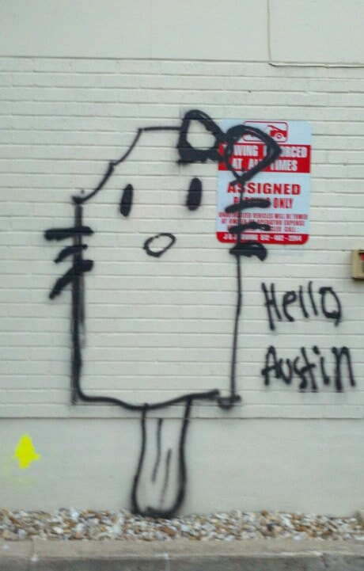
Hello Austin. Circa 2011.

I was an autistic kid on a 286 PC with a 2400 baud internet connection in the pre-internet BBS and AOL era of the early nineties. When the internet took off, a cousin of mine who made a lot of money in web development suggested I become a web developer. I wasn't sure where to start. I started learning PHP on my own. I built a portfolio website for a co-worker who was an artist. I learned so much while building that site about HTTP requests, PHP, AJAX and just programming in general. I've always felt bad about how buggy that site was. Although I haven't talked to that co-worker in 15 years, I just found their current website. I also built a memorial site for a co-worker who'd passed away, though it’s no longer online. At some point I also owned dontbesuchachicken.com. The entire website was this animated GIF.

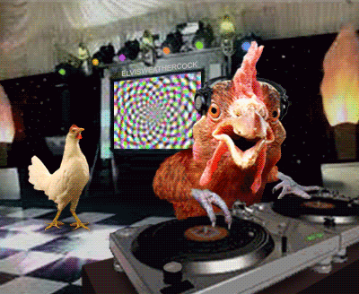
The entirety of dontbesuchachicken.com.

While I was working at the animal shelter, I built a website for them. It had pretty sweet "web 2.0" reflecting buttons and a cute dog with its paws hanging past the hero area. Not long after I left, I believe the shelter was shut down because of poor treatment of animals. I also built a site for a restaurant next door to the shelter, Wild Bubba's Wild Game Grill. I attempted a photorealistic collage style with that one. It was fun to make. Later the Circuit of the Americas racetrack was built about a mile from there.

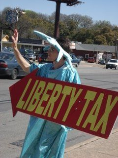
Career development. Circa 2008.

Around this time I started applying to web development jobs in Austin. I built myself a portfolio site, mcdermottsolutions.com, with bright blue and purple colors and a stock photo of something that looked like a Rubik’s Cube. Amazingly, that site did land me a web dev job.

One of the interviews I went to ended up being for a "psychic" who had written books and had tons of websites for them with long rambling content, I assume for SEO to drown out bad reviews. Another I had was for a Republican media agency that did websites for Republicans running for office.

My first web dev job was with a two-man company called S Collective. I took a pay cut from bagging groceries to get a foot in the door of the industry. I started in their office above the TV store and eventually they let me work from home (a couple blocks from the office). Stressful job, but we built some nice WordPress sites. We worked on the local Discount Electronics' website and built a site for the first city-wide initiative to get wifi in local restaurants and small businesses.

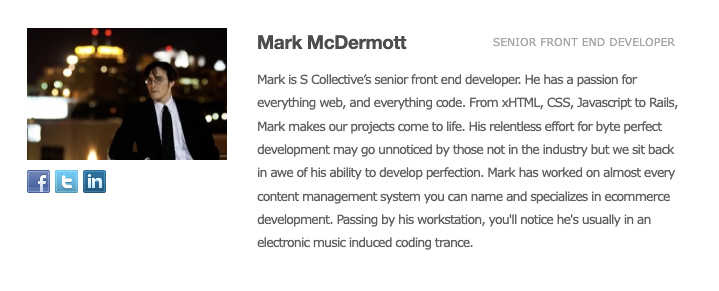
My bio on the S Collective team page, 2010. I did not write the copy.

I also made sites on the side, usually for free, for some non-profits in this era. I was working the phones for the Austin GI Rights hotline and built their site, which I always liked. I also built a site for Under the Hood, a coffeehouse near Fort Hood started by antiwar veterans as a gathering place for soldiers. I built a site for an anarchist thrift shop in Drupal that was always a nightmare to maintain.

Under the Hood website, 2009. Via the Internet Archive.

After I’d been working professionally for a while, I redid mcdermottsolutions.com. This time I paid a [designer](https://sheamediaco.com) whose work I really liked to make a Photoshop mockup, then I sliced it and coded it. I got a friend to take a photo of me working on my laptop outside a Starbucks for it. The version preserved by the Wayback Machine from 2010 includes some of my S Collective work and some extremely 2010 web-developer copy.

mcdermottsolutions.com, 2010. “I got a fever and the only prescription is more jQuery.”

After S Collective was uShip. I remember wearing a suit to the interview and they said they'd hire me but I couldn't wear the suit to work. I would ride my bike to the Austin Metrorail and take my bike on the train to get to the office downtown. I remember my first days walking into their office downtown near 3rd and Brazos. I really felt like a bigshot, working downtown and walking past the skyscrapers to get to work.

uShip had Razor scooters around the office, although I seemed to be the only person who actually used them. I'd ride one from my desk to the coffee station. I actually got pretty good at riding one with a full cup of coffee. I was so new to office life that I didn’t know you weren’t supposed to put an empty coffee carafe back on the hot plate, and I broke a couple before they made an announcement about it.

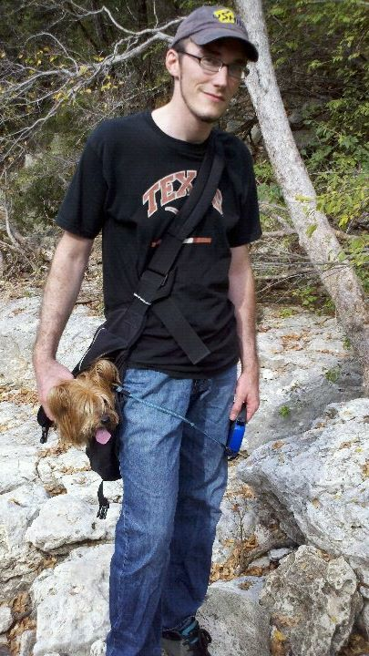
Hiking in Austin with my dog Abby and my uShip hat, 2011.

I always felt awkward at uShip. It was a pretty hip crowd that hosted local bands for SXSW, tapped office kegs on Friday afternoons and rented Lake Travis party barges for offsites. I had never worked in large codebases and felt like a WWII codebreaker trying to decipher what these thousands of .NET C# files were doing.

I did light front-end work at uShip, mostly CSS and JavaScript. They wanted to promote me to a real dev job there and encouraged me to learn more JavaScript and to start taking on some Jira tickets. They recommended reading "JavaScript: The Good Parts", which I did, but somehow I never made the jump to a dev job there.

After uShip was BancVue, a sort of stressful agency-type QA job where I changed a lot of bank website banners. And then Charles Schwab. Schwab was a little surreal: huge office buildings with lots of glass walled conference rooms and really outdated software. I loved my boss there. I realized my quality of life at work was directly related to what kind of boss I had. I wore a suit to my Schwab QA gig, but no one else on my team did. I was really trying to move up to a dev job, but it never happened.

I started wondering if having a CS degree would help me. I considered a second undergrad degree, but eventually started pursuing a Masters at Texas State. School taught a lot of cool fundamentals like C, SQL, bash, data structures and compilers, but almost nothing that had come out in the past 10 years. School had me so busy I didn't have much time to learn the big frameworks like Angular and React or even to stay current with changing technologies like CSS3 and ES6.

For many years in this era, I'd study late into the night (often at coffeeshops), then sleep 3 or 4 hours and then slam espressos the next day to get through work. I was never proud of it and knew it couldn't be improving my body.

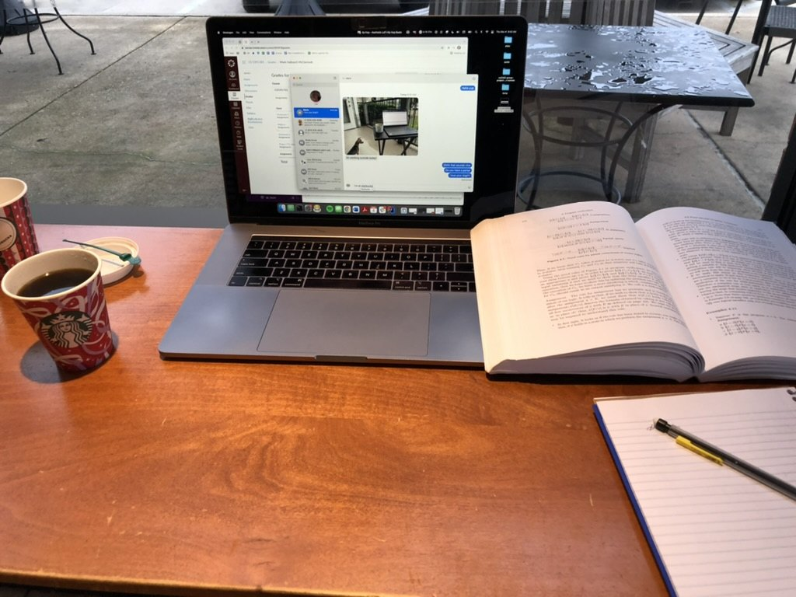
I measured my life in coffee cups.

For years I lived on the drag in Austin near University of Texas at 30th and Guadalupe in a brown-brick apartment building with faded beige trim and burnt-orange doors. It was actually about 100 feet from the drag, behind the old firehouse, which was then a dance studio. I lived across the street from El Patio, a family run TexMex place, and half a block from Wheatsville, the worker-owned organic food co-op.

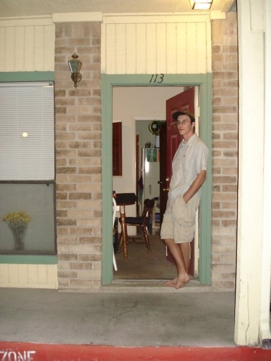
3000 Guadalupe St., circa 2008. Rent was $800/month.

I lived in an efficiency unit and next to me lived a guitar player who I could hear practicing through the walls. It never bothered me. I grew up listening to my dad practicing clarinet every day. His childhood aspiration had been to play like Benny Goodman, who was sort of a rock star to my dad. There is always something soothing to me about hearing people play scales over and over.

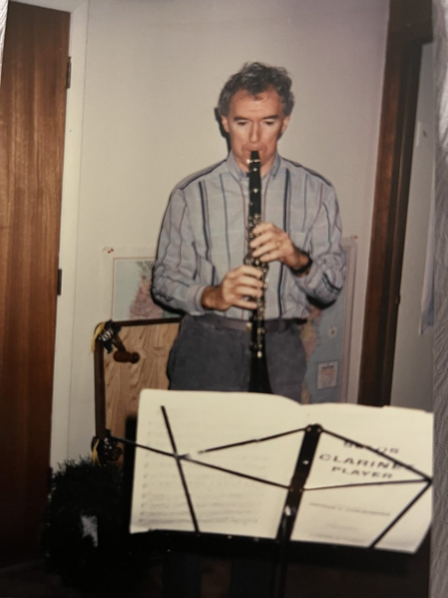
My dad channeling Benny Goodman.

I first met my wife at Spider House Cafe, about a block from my apartment. I used to go there all the time and study and drink coffee and eat nachos. It was a quirky place with weird decorations like a rusty bumper car and a fountain with a cherub urinating into an old bathtub. There was a random tattoo parlor at the back of the patio and later, a delicious crêpe food truck appeared called DJ Crepes with a Miami Vice-inspired logo. Spider House closed during Covid.

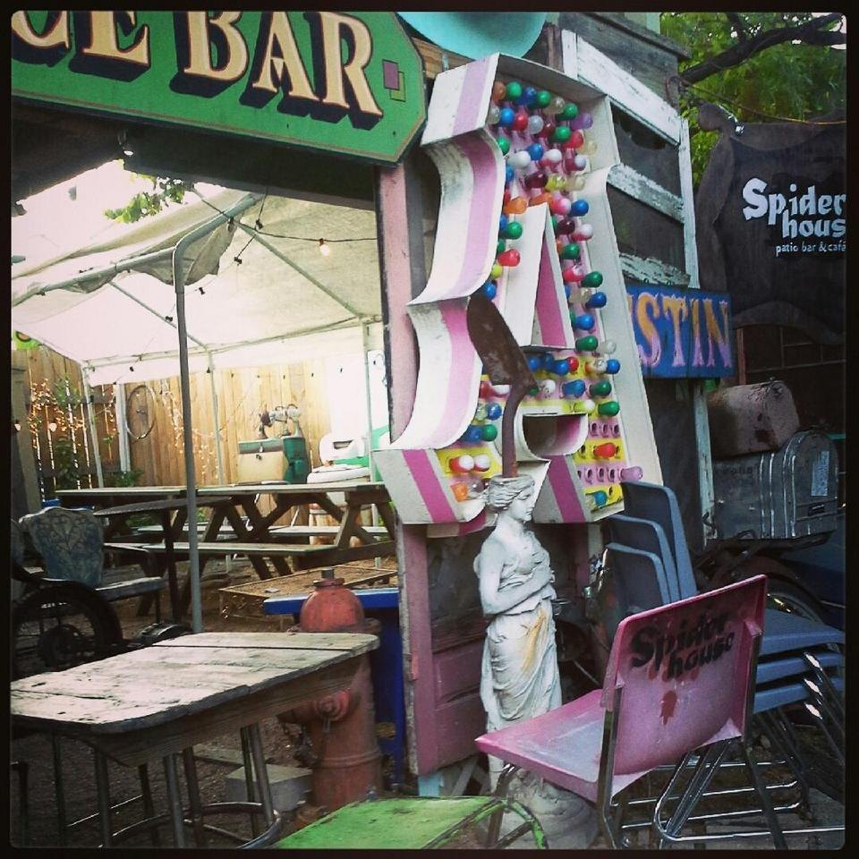
Spider House Cafe, a block from my apartment.

My wife and I used to hang out with friends I'd met in my graduate program. We'd all go to Epoch coffeeshop on South Congress and laugh a lot and work on our laptops. I also spent a lot of late nights around then studying at the 24-7 Epoch on North Loop. I always thought their coffee was kind of watery, but the music was always good. There were often other web developers there on their laptops, too. One time I met an artist there who painted a picture of me while I was working. I took art lessons from her for a bit after that.

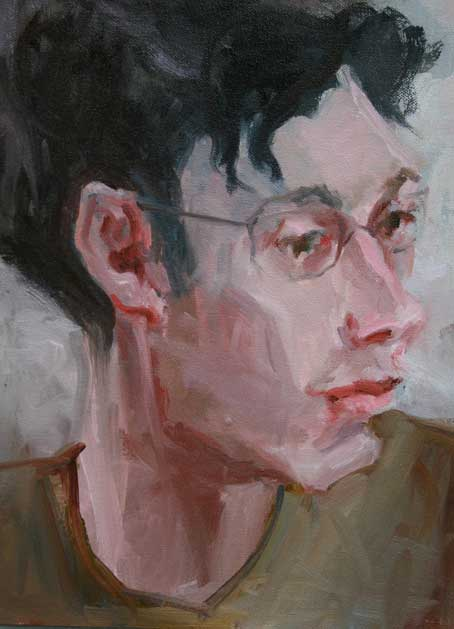
Portrait of me painted at Epoch Coffee, 2008.

My wife and I got married at a lovely wedding venue in South Austin. I think it was 114 degrees. At the last minute, we rented big fans, but they barely helped. Heat aside, it was a beautiful day. I got to chat with family members I hadn't seen for years and many whom I haven't seen since. I don't think I've ever seen a more beautiful woman than my wife on that day.

All non-native Austinites claim that Austin's prime was right when they got there and that it's all been downhill since. My early Austin era smelled like a dive bar and sounded like tinnitus. Skrillex played Cheer Up Charlie's packed outdoor stage, followed by Moby. Tycho played in a SXSW tent the size of my bedroom. Ghostland Observatory played a packed parking lot show with kids hanging from the set rafters. My wife and I saw Daikaiju play three times: sweaty, tattooed dudes with no shirts wearing kabuki masks lighting their cymbals on fire with lighter fluid. My buddy broke his glasses at their show when a crowdsurfer accidentally kicked him in the face. My wife and I went and saw This Will Destroy You, but she thought the music was too slow and boring and we left (I had told her prior that their music would be slow and boring).

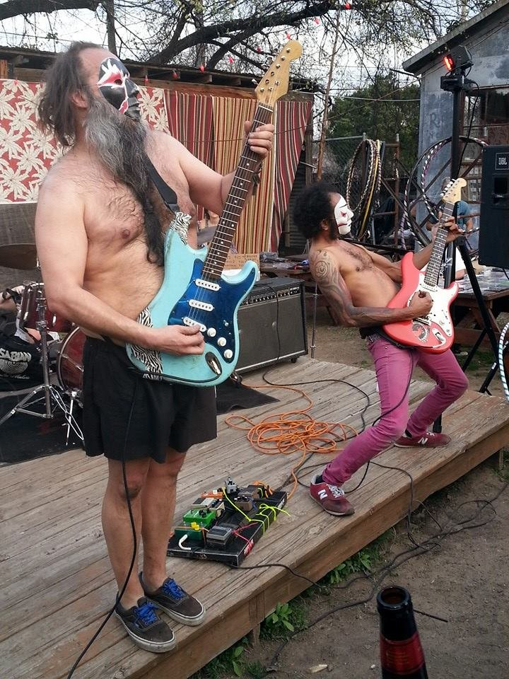
Daikaiju at Surf By Surf East, The Vortex, March 2015.

There were other little coffeeshops I'd go to, too. Monkey Nest was there on Burnet. It was always really loud with undergrad students. Later Summer Moon coffeeshops started popping up around Austin. There was something decidedly un-Austin about Summer Moon. Beautiful, expensive looking branding. Coffee tasting more like a sugary dessert than a watery, black all-nighter patio coffee at Epoch. But we eventually succumbed to temptations.

I watched Austin's East Side gentrify, too. Somebody put "Yuppies off the East Side" graffiti all over town. Then someone else put up "Stencillers off the West Side."

When the Occupy movement happened, people started sleeping in front of City Hall. I remember sleeping out there one night and then walking half a block to one of the skyscrapers where my parents' 12th story apartment was, taking a shower at their place and then going to work at uShip. I helped build the Occupy Austin website. Sometimes it was hard to focus at work after doing so much Occupy stuff after-hours. And I wasn't really close enough to anyone at work to tell them about my after-work activist alter ego.

In the aughts, there was a tug of war in Austin between the '90s slacker Austin and the 2010s hustle hard, tech hub, "mini San Francisco" Austin. I would relax at Twin Falls on the weekends and would dutifully watch Linklater's "Slacker" once a year. But then I'd bust my butt learning web development and going to programmer meetups. I'd go to the Thich Nhat Hanh meditation group every Sunday and try to learn to be less type A. I'd go to Deer Park monastery in California and try to learn from the way the monastics walked so lightly.

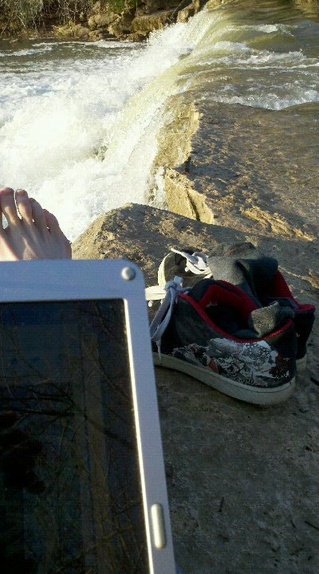
Type A style relaxation near the Hill of Life, circa 2012.

For my graduate program, I had the option of doing a thesis or taking some extra classes. Of course I chose the hard route, the thesis. I ended up building the software for it from scratch, and it took me an extra year and a half. I may have learned more writing that code than I did from anything else in the degree.

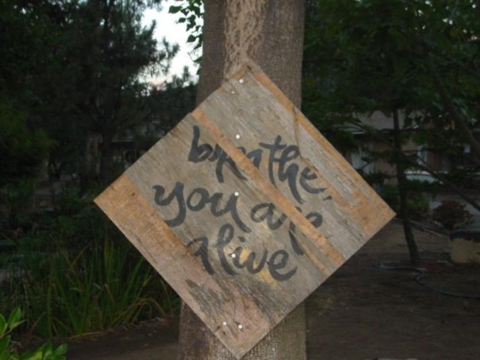
"Breathe, you are alive." Deer Park Monastery, Escondido, CA. Circa 2008.

After Schwab I thought I finally caught my white whale. A buddy from Texas State helped me get a programmer gig where he worked at Axzon, an engineering company. He and I were the whole software department. With his help, I set up a Jenkins CI/CD box and was writing a testing suite in Java. But a couple months in, the sales department had a rough quarter and half the company got laid off, including the entire software department.

After being laid off from Axzon, things were a little tense because my wife was pregnant with our daughter and I wanted to make sure we had income coming in. I was lucky to quickly land a QA gig with Doximity, where I've been since. It's been six years now. My daughter was born and I consider her a Doximity-baby. When she was little, I'd go into Zoom calls with her sleeping on my shoulder. We also had an elderly Shih Tzu dog then, who I remember pooping on the floor behind me in a Zoom call once.

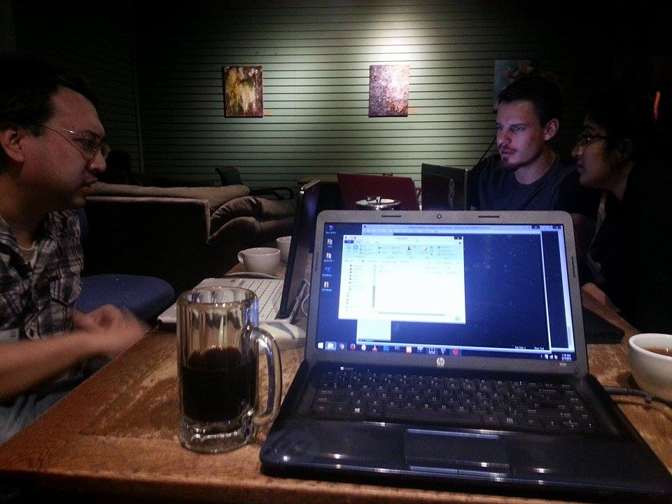
Bennu coffeeshop, circa 2015.

My wife and I have been getting Summer Moon coffee nearly every day for years. The baristas at the drive-through know our orders. New Austin to me is grabbing Summer Moon on a Saturday and taking my daughter to a birthday party at a new splash pad in the Shoal Creek park where I used to hang out. The dads and I talk about summer travel plans while my daughter discovers the joys of Super Soakers. The kids scream with joy as they splash in the water. I keep one eye on my coffee sitting on the ledge while I ask my daughter not to shoot her friends in the eyes. Austin randomly became my home. Now it's hers, too.
